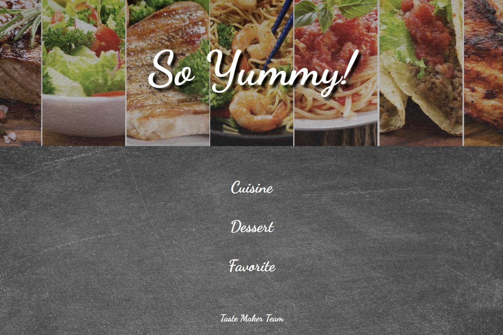

# Taste-Maker
Recipe finder app 

## User Story
I want to cook something for dinner but I don't know what to cook. With the Taste Maker app I can choose between protein  and cooking style options to decide what to make.
 
 ## Description
 The User can decide between protein and cooking styles to find a wide variety of recipes to try. They can save a list of favorite recipes to reference at a later date and can follow along a youtube video on how to make their desired dish. The User will have a seamless experience getting data from the Spoonacular and YouTube APIs.

 

## When user clicks cuisine/dessert
* Will be presented with four cuisine styles: French, American, German, and Italian
* Will be presented with three dessert sytles: cookies, cakes, and pies
* Each style containes 10 different recipes
* Each recipe will provide a video to go along with it
* When favorite button clicked, recipe will be saved to homepage
* When home button clicked, it will always take you back to the homepage 

## Live Application
https://ag6793.github.io/Taste-Maker/

## Acceptance Criteria
* When homepage loads, the User has a choice of 4 protein options
* When homepage loads, the User has a choice of style of cuisine
* When homepage loads, the User has a choice of desert options
* When 'Go/Make Recipe' button is clicked User is presented with recipe multiple options.

## API
* Spoonacular: https://spoonacular.com/food-api
* Youtube: https://developers.google.com/youtube/v3

## Contributors
- [ALEXANDRIA GUERRERO](https://github.com/Ag6793)
- [EMMA VASQUEZ](https://github.com/emmavazquez13)
- [ERICA MORABITO](https://github.com/ericaemorabito)
- [DANIEL MCCORMICK](https://github.com/DCMcCormick)
- [ADAM GONTERMAN](https://github.com/adamgonterman)
- [XIAO LEE](https://github.com/shelldan)

## License

MIT License

Copyright (c) [2022] [Taste Maker Team]

Permission is hereby granted, free of charge, to any person obtaining a copy
of this software and associated documentation files (the "Software"), to deal
in the Software without restriction, including without limitation the rights
to use, copy, modify, merge, publish, distribute, sublicense, and/or sell
copies of the Software, and to permit persons to whom the Software is
furnished to do so, subject to the following conditions:

The above copyright notice and this permission notice shall be included in all
copies or substantial portions of the Software.

THE SOFTWARE IS PROVIDED "AS IS", WITHOUT WARRANTY OF ANY KIND, EXPRESS OR
IMPLIED, INCLUDING BUT NOT LIMITED TO THE WARRANTIES OF MERCHANTABILITY,
FITNESS FOR A PARTICULAR PURPOSE AND NONINFRINGEMENT. IN NO EVENT SHALL THE
AUTHORS OR COPYRIGHT HOLDERS BE LIABLE FOR ANY CLAIM, DAMAGES OR OTHER
LIABILITY, WHETHER IN AN ACTION OF CONTRACT, TORT OR OTHERWISE, ARISING FROM,
OUT OF OR IN CONNECTION WITH THE SOFTWARE OR THE USE OR OTHER DEALINGS IN THE
SOFTWARE.
